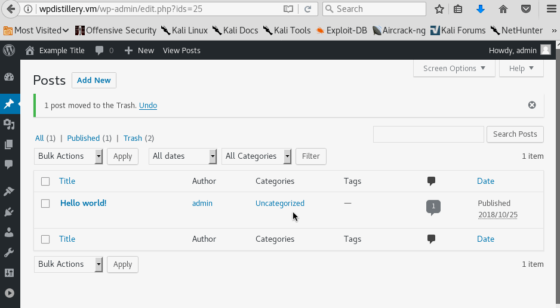

# Project 7 - WordPress Pentesting

Time spent: **8** hours spent in total

> Objective: Find, analyze, recreate, and document **five vulnerabilities** affecting an old version of WordPress

## Pentesting Report

1. (Required) Vulnerability Name or ID: Authenticated Stored Cross-site scripting
- [x] Summary: 
- Vulnerability types: XSS
- Tested in version: 4.2
- Fixed in version: 
- [x] GIF Walkthrough: 
    - 
- [x] Steps to recreate:
    - Create a new post called example, and then put the code```<a onmouseover= "alert('I got you!')" >click here</a>``` in the content link. Finally click link to show message in the preview of post. 
- [x] Affected source code:
- [Link 1](https://core.trac.wordpress.org/browser/branches/4.2/src/wp-includes/class-wp-editor.php?rev=33361)
2. (Required) Vulnerability Name or ID: User Enumeration
- [x] Summary: 
- Vulnerability types: User Enumeration
- Tested in version: 4.2
- Fixed in version: N/A
- [x] GIF Walkthrough:
 -  
- [x] Steps to recreate:
 - Go to the WordPress login page, first, check the input for admin with empty password,
   then it shows the error because the password is empty.Second, when you input admin as    username, and put password randomly.It shows the password for admin is incorrect. When   you put other name (ex.user), and random password, it shows error. 
- [ ] Affected source code:
- [Link 2](https://www.wpwhitesecurity.com/wordpress-security/wordpress-username-disclosure-vulnerability/)
1. (Required) Vulnerability Name or ID
- [ ] Summary: 
- Vulnerability types:
- Tested in version:
- Fixed in version: 
- [ ] GIF Walkthrough: 
- [ ] Steps to recreate: 
- [ ] Affected source code:
- [Link 1](https://core.trac.wordpress.org/browser/tags/version/src/source_file.php)

## Assets

List any additional assets, such as scripts or files

## Resources

- [WordPress Source Browser](https://core.trac.wordpress.org/browser/)
- [WordPress Developer Reference](https://developer.wordpress.org/reference/)

GIFs created with [LiceCap](http://www.cockos.com/licecap/).

## Notes

Describe any challenges encountered while doing the work

## License

Copyright [2018] [Xingcheng Zhang]

Licensed under the Apache License, Version 2.0 (the "License");
you may not use this file except in compliance with the License.
You may obtain a copy of the License at

http://www.apache.org/licenses/LICENSE-2.0

Unless required by applicable law or agreed to in writing, software
distributed under the License is distributed on an "AS IS" BASIS,
WITHOUT WARRANTIES OR CONDITIONS OF ANY KIND, either express or implied.
See the License for the specific language governing permissions and
limitations under the License.
